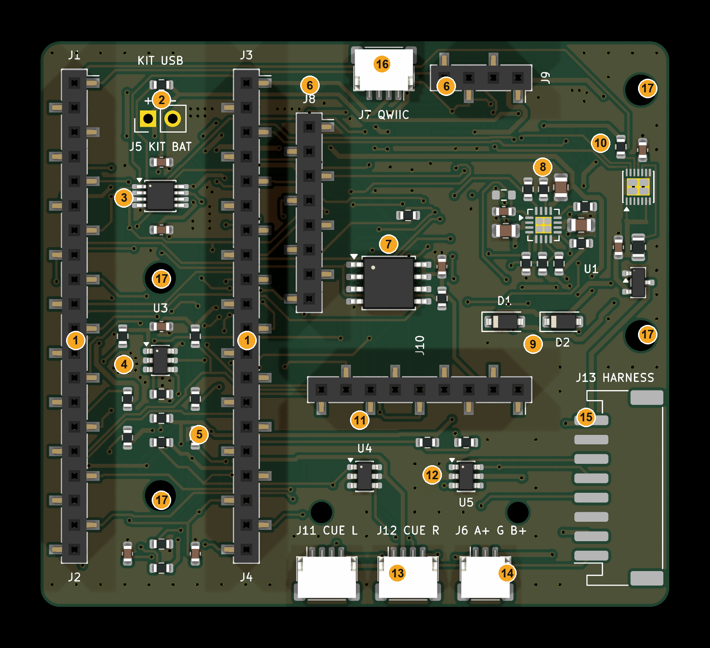

# The carrier board, explained

Written 2026-09-27 for rev A3 (`hardware/carrier/pcb/carrier.kicad_pcb`), for someone new to hardware. `hardware/carrier/SPEC.md` has the engineering detail and the datasheet references.

The carrier is the "motherboard" of the test collars. The three small boards we bought plug into it, and it holds everything around them: power from the sun, the battery connection, the sound cues and protection. It replaces the jumper wires of the bench prototype.

It's for **V1-alpha**, the first 5–10 test collars, which use a plain test box. The final V1 collar merges all of this into one slim board shaped to the top of the neck (`docs/COLLAR-FIRST-PRINCIPLES.md`).



## The boards that plug in

**1. Connect Kit sockets (J1–J4).** The Makerdiary nRF9151 Connect Kit plugs in here, pins down, into two rows of 20 contacts. It's the brain:
- The nRF9151 chip runs our firmware.
- It talks over **LTE-M**, a low-power cellular network, and its LTE antenna is on the Kit itself.
- It has a USB port for programming.
- It supplies the clean 3.3 V that powers the other plugged boards.

**6. GPS sockets (J8, J9).** The SparkFun MAX-M10S GPS board plugs in here. It's the main position sensor, the one the virtual fence relies on. Its antenna connector points off the edge of the board toward the antenna.

**11. Motion sensor socket (J10).** The Adafruit ISM330 motion board, an accelerometer plus gyroscope, plugs in here. It shows whether the animal is walking, grazing or lying down, and can wake the collar when it moves.

These three boards sit about 11 mm above the carrier on their sockets. Most of the carrier's own parts are tucked underneath them, which is how the board stays at 65 × 58.5 mm.

## Power: sun → battery → Kit

**14. Solar panel socket (J6).** The two solar panels on the box lid plug in here: panel A, ground, panel B.

**9. Panel diodes (D1, D2).** One per panel. They're one-way valves, so a panel in the sun can't push current back into one in shade.

**8. Solar charger (U1, bq24074) and its small parts.** This is the power hub:
- **Charging:** it takes the panels' power and charges the battery, at up to about 0.5 A.
- **Powering:** at the same time it feeds the Kit. On a sunny day it can run the collar straight from the panels, even with the battery disconnected.
- **Temperature:** it watches the battery's temperature sensor through the harness and won't charge when the battery is too cold or too hot.
- **Status:** it tells the Kit whether it's charging and whether the sun is up.
- **Small parts:** the tiny resistors around it set the charge current and safety timer; the capacitors smooth its input and output.

**2. Kit battery feed (J5).** Two holes where a short pigtail carries the charger's output into the Kit's battery connector. The Kit's pin rows have no battery pin, so it needs this separate connection.

**10. Battery guard and fuel gauge (new in rev A3).** A column of parts between the harness and the charger:
- **Q1** is the reverse-battery guard. If a battery is ever wired backwards, it blocks it instead of letting it destroy the charger and the Kit.
- **R24** is a tiny 0.01 Ω resistor that all battery current passes through.
- **U6**, the fuel gauge, measures the voltage across R24 and counts the charge flowing in and out of the battery. It reports how full the battery is and how much energy came in each day. That's how the test collars will show whether the 60-day battery goal holds up on real cattle.

**5. Measuring parts.** Resistor pairs let the Kit read the battery voltage, the panel voltage and the charge current. The rest are "pull-up" resistors that hold signal lines at a known level.

## Memory

**7. Flash memory (U7, 16 MB, new in rev A3).** It stores GPS logs when there's no phone signal in the pasture, and uploads them later. That's about 5 days of detailed position data.

## Connections leaving the box

**15. Harness socket (J13).** Eight wires run through the strap to the battery module under the throat:
- Battery + on two wires, and ground on two wires, so one broken wire doesn't cut the power.
- The battery's temperature sensor.
- A data connection (I2C, two wires) and an alert line, for smart parts in the battery module later.

**13. Sound cue ports (J11 left, J12 right).** Cables to the two ear pods, each with a buzzer. The collar steers the animal with a sound on the left or the right side. Cattle can tell which side a sound comes from to within about 30°.

**3. Bus buffer (U2).** It separates the collar's internal data wiring from the cables going outside. If a strap cable is cut or shorted, the inside keeps working, and the buffer unsticks a jammed line on its own.

**4. Power switch (U3).** It powers the outside devices (buzzers, battery module) only when needed, which saves battery. If a cable shorts, it caps the current at about 260 mA.

**12. Static protection (U4, U5).** Every wire leaving the box goes through these, so a static spark from the animal or a cable doesn't reach the chips.

**16. Spare Qwiic socket (J7).** It stays inside the box, for plugging in a sensor on the bench.

## Holding it together

**17. Mounting holes.**
- The two holes under the Kit screw the carrier to the box.
- The two on the right do double duty: standoffs there hold the GPS board and also screw the carrier down.
- The IMU gets two small M2 standoffs of its own.

**Underneath:** 33 gold test pads, one for each important signal, so a meter or a test fixture can check a finished board without touching the top (`docs/TEST-FIXTURE.md`). The underside also carries the harness pinout, printed for when you're wiring it.

## How it fits into the collar

```
   ear pod L ── cable ──┐                         ┌── cable ── ear pod R
   (buzzer)             │   TEST BOX on the crest │            (buzzer)
                        │   solar panels on top   │
                        │   carrier + Kit + GPS   │
                        │   + motion sensor       │
                        │   GPS & LTE antennas    │
                        └──────────┬──────────────┘
                                   │ harness inside the strap
                                   │ (M8 plug in the box wall)
                        ┌──────────┴──────────────┐
                        │  BATTERY MODULE (throat) │
                        │  6600 mAh pack + temp    │
                        │  sensor + fuse + steel   │
                        └──────────────────────────┘
```

- **On top of the neck:** the test box. The antennas and panels need open sky, and the top of the neck is the only spot the animal doesn't shade.
- **Under the throat:** the battery module. It's deliberately heavy (battery plus steel, at least 1.8× the weight of the top), so gravity keeps the collar upright, the way Halter's does. The collar adjusts at the bottom, equally on both sides, to fit 75–130 cm necks.
- **Wiring:** the panels plug into J6, the ear pods into J11 and J12, and the harness into J13 through the waterproof M8 socket on the box wall.
- **A typical day:** the sun charges the battery through the harness and runs the collar. At night the battery runs everything. The GPS tracks position; the Kit checks it against the virtual fence, sends reports over LTE-M and triggers the left or right buzzer when needed. The fuel gauge and flash record what really happened.
- **If the strap wire is cut:** the collar keeps running on sun alone by day and logs the fault.

## How the picture was made

`kicad-cli pcb render --side top` of `hardware/carrier/pcb/carrier.kicad_pcb`, with numbered labels drawn at part positions (board millimetres converted to render pixels at 21.26 px/mm). Rerender it if parts move.
