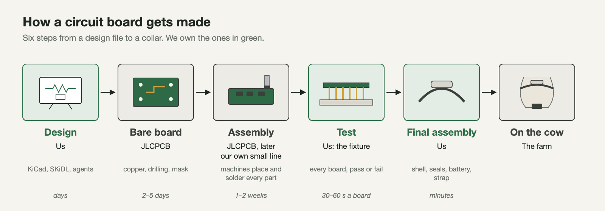
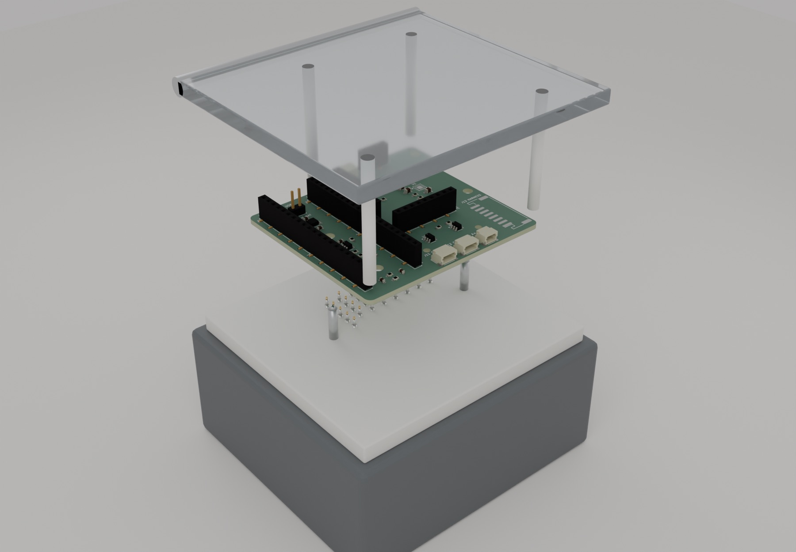
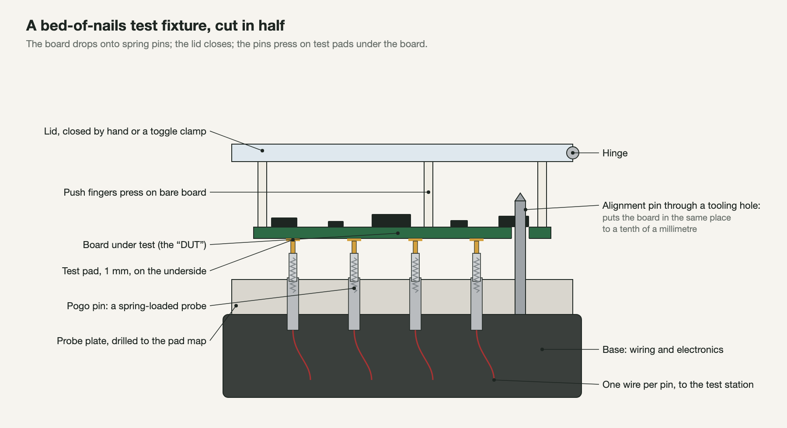
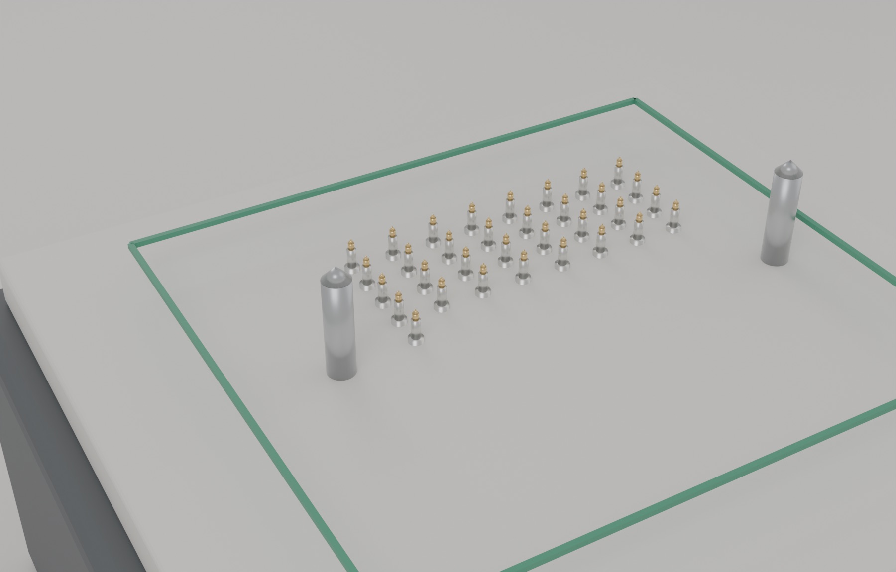
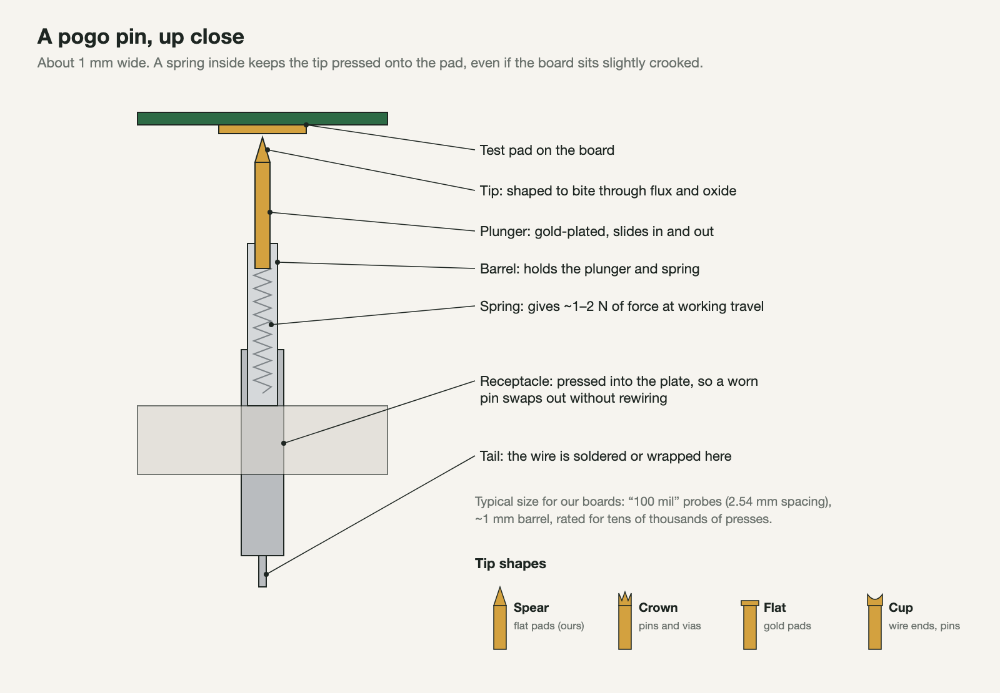
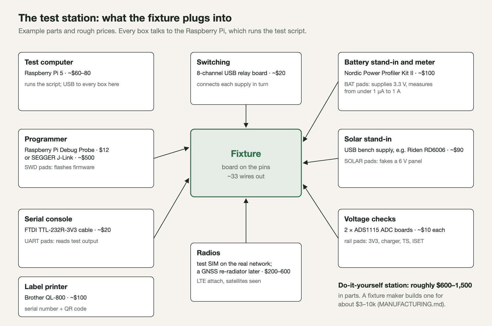
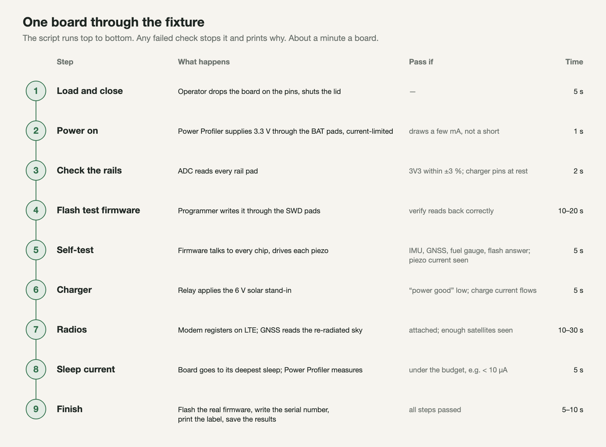
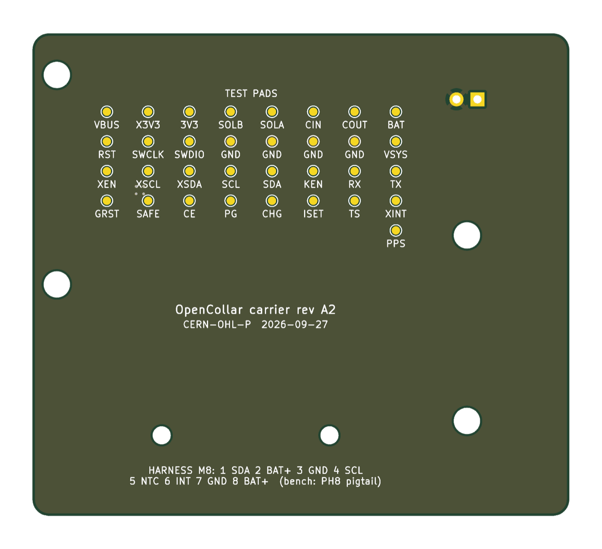
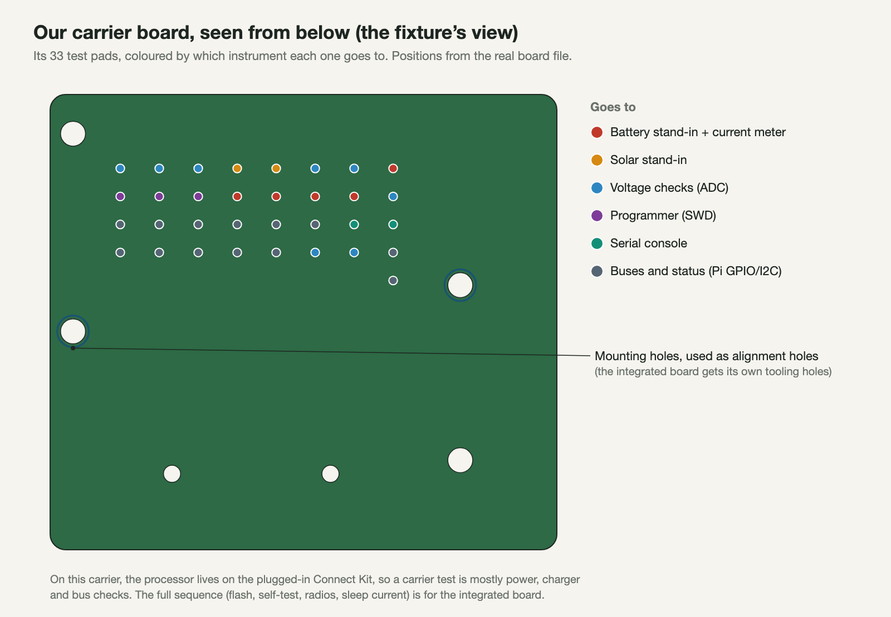
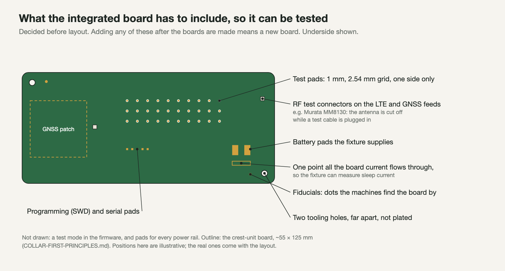

# Testing boards: the test fixture, from zero

Written 2026-09-27 for someone who has never done hardware. It covers what a test fixture is, the parts one is made of, what it checks on each board, and what that means for how we design our boards. Prices are typical list prices from memory, to check before buying anything. Nothing here has been ordered.

## 1. Where testing fits



A board goes through six steps. Two of them happen in factories we rent: JLCPCB makes the bare board and solders the parts on. **Test** is the step where we find out whether each board actually works before it goes into a collar. A board can look perfect and still have one bad solder joint, a chip placed backwards, or a part that leaks a little current and would flatten the battery in a week. The only way to know is to power every board up and check it.

Testing by hand with a multimeter is fine for 5 boards. For 500 it's days of work, and people get tired and miss things. So factories use a **test fixture**: a jig that checks a board in about a minute, the same way every time.

## 2. What a test fixture is



*Our real carrier board above a fixture, pulled apart so you can see the layers. Top to bottom: a clear lid on a hinge, the board, the probe plate with its spring pins, and the base with the wiring.*

It's often called a **bed of nails**. You drop the board onto a plate of spring-loaded pins, close the lid, and the pins press against small bare copper spots on the underside of the board: the **test pads**. Each pin is wired to test equipment. Now a computer can "touch" every important point on the board at once, without anyone holding a probe.



- **The alignment pins** go through holes in the board, so it always lands in exactly the same place and each pin hits its pad.
- **The push fingers** on the lid press the board down onto the pins. They land on bare board, never on parts.
- **The pins are springs**, so small differences in board thickness or flatness don't matter.

## 3. The bed of nails



*The probe plate on its own. There's one gold pin under each of our carrier board's 33 test pads, placed from the real board file. The green frame is where the board sits. The two tall steel pins are the alignment pins.*

Each pin is a **pogo pin**:



| Part | Example | Rough price |
| --- | --- | --- |
| Pogo pins, cheap | Generic "P75" series (e.g. P75-E2, spear tip), 1 mm barrel, 2.54 mm spacing | ~$0.10–0.50 each |
| Pogo pins, good | INGUN GKS-100 series (German fixture maker) | ~$2–5 each |
| Receptacles | Matching sockets pressed into the plate (e.g. R75-2W), so worn pins swap out | ~$0.10–1 each |
| Probe plate | CNC-cut G10 or delrin. **Or order it as a circuit board from JLCPCB**: its drill file is just our test-pad positions | ~$10–50 |
| Lid clamp | A toggle clamp (DE-STA-CO 202-U or a generic copy) or a simple hinge | ~$10–30 |
| Frame | 3D printed on the Ender, or laser-cut | cents to ~$50 |

## 4. The test station: what the fixture plugs into

The fixture itself is just pins and wires. The checking is done by a small set of instruments, all driven by one computer running a test script:



| Job | Example part | Rough price | What it does |
| --- | --- | --- | --- |
| Test computer | Raspberry Pi 5 | ~$60–80 | Runs the test script, talks to every instrument over USB, stores the results |
| Programmer | Raspberry Pi Debug Probe | $12 | Loads firmware through the board's SWD pads. It's the same kind of programmer (CMSIS-DAP) we already use to flash the Connect Kit with pyOCD |
| | or SEGGER J-Link | ~$500 | The industry standard; Nordic's tools use it |
| Battery stand-in and current meter | Nordic Power Profiler Kit II | ~$100 | Pretends to be the battery (it supplies 0.8–5 V) and measures current from under a microamp up to 1 A. It's also on our deferred-parts list for power measurements anyway |
| Solar stand-in | A USB-controlled bench supply, e.g. Riden RD6006 | ~$90 | Pretends to be the solar panels: 6 V, current-limited |
| Voltage checks | 2 × ADS1115 ADC boards | ~$10 each | Reads the voltage on each power rail pad |
| Switching | 8-channel USB relay board | ~$20 | Connects and disconnects the supplies at each step |
| Serial console | FTDI TTL-232R-3V3 cable | ~$20 | Reads the messages the board's firmware prints |
| Radios | A test SIM on the real LTE network; later a GNSS re-radiator (an outdoor antenna that re-broadcasts satellite signals indoors) | $0; $200–600 | Checks the modem connects and the GNSS sees satellites |
| Label printer | Brother QL-800 | ~$100 | Prints a serial-number label with a QR code |

**About $600–1,500 in parts for a station we build ourselves.** A fixture company would build one for about $3–10k (`MANUFACTURING.md`). We'd build the first one ourselves: it's a good project, and the same station serves every future board.

## 5. One board through the fixture



The script is plain Python. Each step has a pass/fail rule, and the first failure stops the test and says why ("3V3 rail is 2.1 V: expected 3.2–3.4 V"). Every result is saved against the board's serial number. When a collar comes back from a farm, we can look up exactly how that board tested on the day it was made.

The **sleep-current check** matters most for us. A board that "works" but draws 200 µA asleep instead of 5 µA flattens its battery in weeks, not the 60 days we promise. Nothing else would catch that before a farmer did.

## 6. Our carrier board today



*The real carrier board from underneath. The yellow dots are the 33 test pads; the white circles are holes.*



The carrier was designed with test pads from the start (`hardware/carrier/SPEC.md` section 7). It's missing two things a production fixture wants:
- **Dedicated tooling holes.** The pictures use two of its mounting holes as stand-ins.
- **The brains:** the processor is on the plugged-in Connect Kit, not on the carrier. So a carrier test is mostly power, charger and bus checks.

For 5–10 alpha boards, a multimeter and a bench supply are enough anyway.

## 7. What the integrated board has to include

"Designing the test fixture alongside the board" means these go into the board's spec before layout starts:



| Feature | Why | Example |
| --- | --- | --- |
| Test pads for every rail and signal the script checks | The pins need something to press on | 1 mm round pads on a 2.54 mm grid, all on the underside |
| Two tooling holes, far apart | Puts every board in exactly the same spot | 3 mm unplated holes in opposite corners |
| Fiducials | Lets the assembly machines and the fixture camera find the board | 1 mm copper dots |
| Battery pads plus one current path | So the fixture can power the board and measure sleep current | All board current flows through one point |
| Programming and serial pads | Flash firmware, read test output | SWD (clock, data, reset) and UART pads |
| RF test connectors | Check the LTE and GNSS radio paths with a cable instead of over the air | Murata MM8130 switch connector: plugging a test cable in disconnects the antenna |
| A test mode in the firmware | The board has to answer "test yourself" commands | A small command set on the serial port |

Miss one of these and you find out after the boards are made. At that point it's a new board, or testing by hand.

## 8. How we'd build our first fixture

1. **Export the pad map.** The positions come straight from the board file: `images/test-fixture/export_pads.py` writes them to `tp.json`.
2. **Order the probe plate as a circuit board from JLCPCB:** a blank board whose drill holes are the pad positions, sized for the receptacles. It costs a few dollars and is accurate to a fraction of a millimetre.
3. **Press in receptacles, drop in pogo pins,** and solder one wire from each to a terminal board.
4. **Print the frame and lid** on the Ender, with two steel dowels as alignment pins and a toggle clamp.
5. **Wire up the station** (section 4) and write the test script: one Python file, one function per step in section 5.
6. **Test the fixture with a known-good board,** then a deliberately broken one, to make sure it catches the fault.

## 9. Words you'll hear

| Word | Meaning |
| --- | --- |
| **DUT** | "Device under test": the board being tested |
| **Bed of nails** | A fixture with a plate of spring pins |
| **Pogo pin** | A spring-loaded probe pin |
| **Test pad / test point** | Bare copper on the board for a pin to touch |
| **Tooling hole** | A hole only for positioning the board |
| **Fiducial** | A copper dot machines use to find the board's position |
| **FCT** | Functional test: power it up and check it works (what this document describes) |
| **ICT** | In-circuit test: measures each part individually with many more pins. Common in big factories, overkill for us |
| **Flying probe** | A machine with moving probes instead of a fixture; slow but needs no fixture. Some assemblers offer it |
| **AOI** | Automated optical inspection: a camera checks the soldering. The assembler does this |
| **SWD** | Serial Wire Debug: the two-wire port used to program ARM chips like the nRF9151 |
| **UART** | A simple serial text connection, for the board's messages |
| **Sleep current** | What the board draws while idle; sets battery life |
| **Yield** | The share of boards that pass. 98 % yield means 2 in 100 need rework |

## 10. How these pictures were made

Everything here is regenerated from the real board:

```sh
cd hardware/carrier && source env.sh
uv run python schematic.py && kicad-python layout.py build/carrier.net build/carrier.kicad_pcb
kicad-cli pcb export glb --subst-models --include-tracks --include-pads --include-silkscreen \
    --include-soldermask --include-zones --output build/carrier.glb build/carrier.kicad_pcb
cd ../..
kicad-python docs/images/test-fixture/export_pads.py \
    hardware/carrier/build/carrier.kicad_pcb docs/images/test-fixture/tp.json
python3 docs/images/test-fixture/diagrams.py                 # the SVG diagrams
/Applications/Blender.app/Contents/MacOS/Blender --background --factory-startup \
    --python docs/images/test-fixture/render_fixture.py -- \
    hardware/carrier/build/carrier.glb docs/images/test-fixture/tp.json docs/images/test-fixture
```

The PNG diagrams are the SVGs screenshotted by headless Chrome; the renders were converted to JPEG with `sips`.
