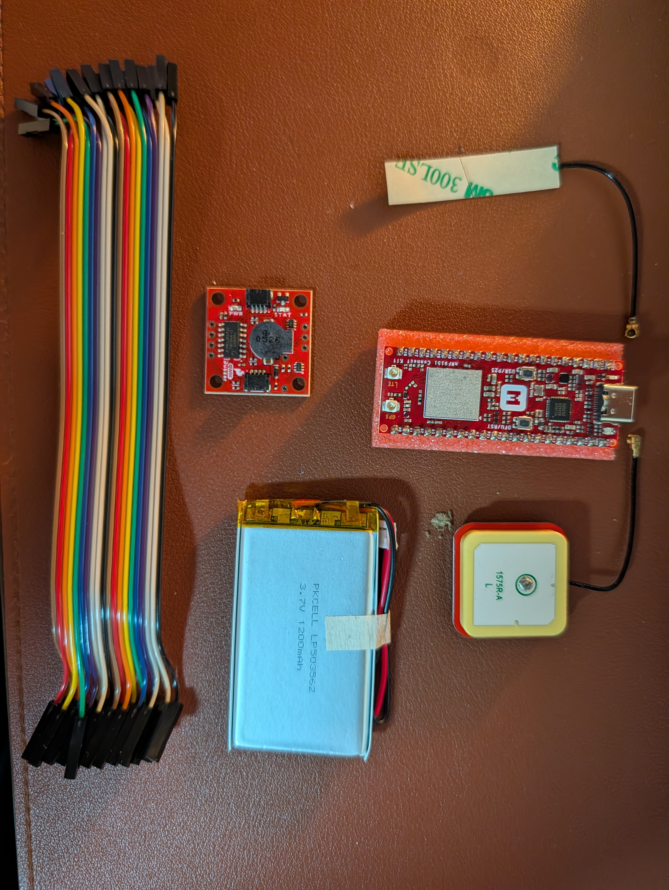

# Bill of materials

| Part | Model | Qty | Role | Notes |
| --- | --- | --- | --- | --- |
| Main board | Makerdiary nRF9151 Connect Kit | 1 | MCU + LTE-M/NB-IoT modem + GNSS | nRF9151 SiP (Cortex-M33). nRF52820 interface MCU gives CMSIS-DAP flashing and USB-UART over USB-C. BQ25180 LiPo charger, TPS63901 buck-boost. Nano-SIM slot. U.FL for LTE and GPS. Onboard GNSS LNA, enabled by nRF9151 `COEX0`. Firmware: nRF Connect SDK / Zephyr. |
| LTE antenna | Flexible adhesive antenna, U.FL | 1 | Cellular | 3M 300LSE adhesive backing. Connects to the `LTE` U.FL. |
| GPS antenna | Ceramic patch, 1575R-A, U.FL | 1 | GNSS | Connects to the `GPS` U.FL. Ceramic face points at the sky. |
| Buzzer | SparkFun Qwiic Buzzer (BOB-24474) | 1 | Audio cue | I2C, default address 0x34, 3.3V. ATtiny84 onboard handles tone, volume, duration. Qwiic (JST-SH 4-pin) connectors; 0.1" through-holes have no headers fitted. |
| Battery | PKCELL LP503562, 3.7V 1200mAh LiPo | 1 | Power | 2-wire lead with connector. Polarity must be checked against the board before connecting. |
| Jumper wires | Dupont female-female, ribbon | 1 set | Bench wiring | |

## Still needed

| Part | Why |
| --- | --- |
| Nano-SIM with LTE-M data | Board can't reach the network without one. Hologram, Onomondo, Soracom, or 1NCE. |
| Qwiic to female-jumper cable (SparkFun PRT-14988) or 4-pin 0.1" header + soldering iron | Dupont jumpers can't plug into the buzzer as-is. |
| USB-C data cable | Flashing, serial logs, charging. |
